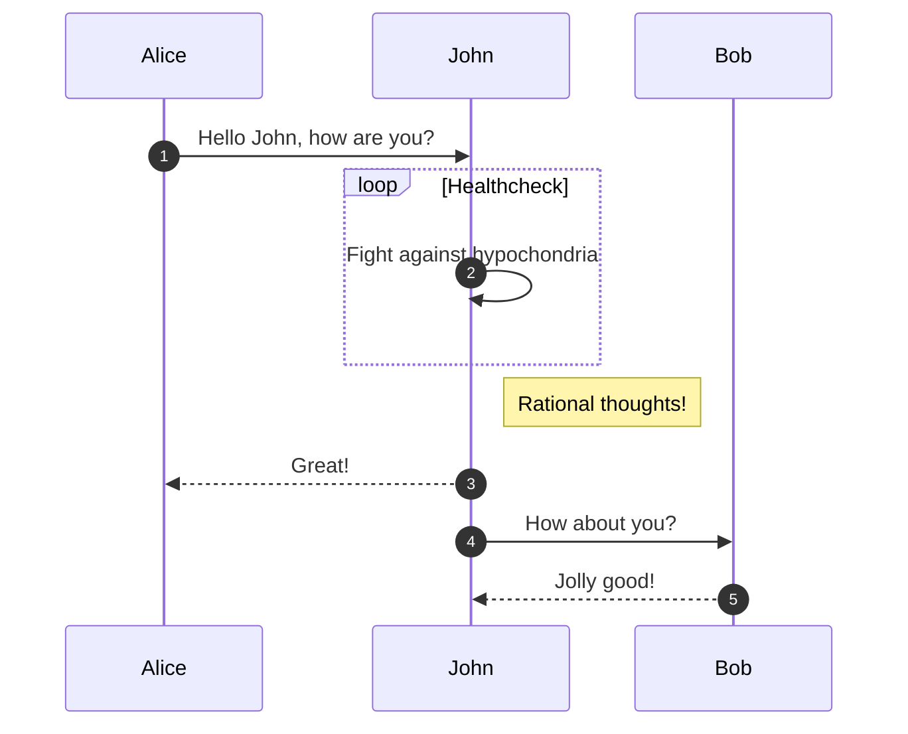
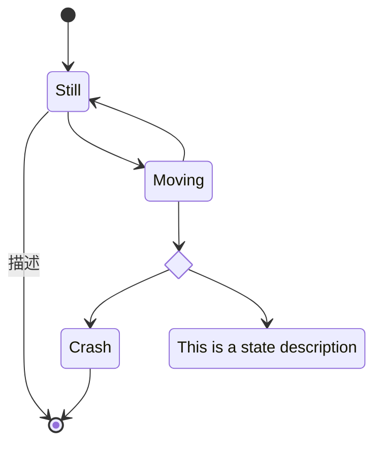
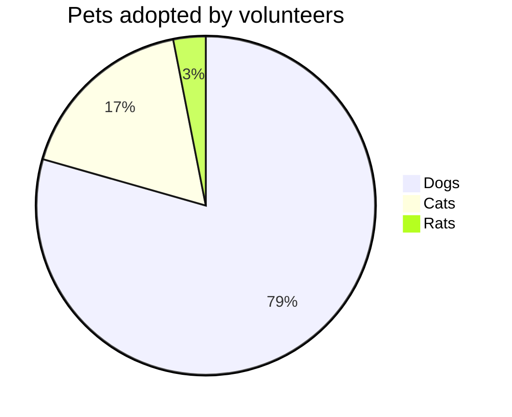
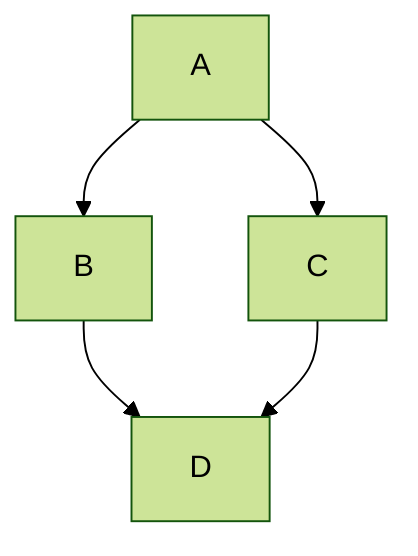
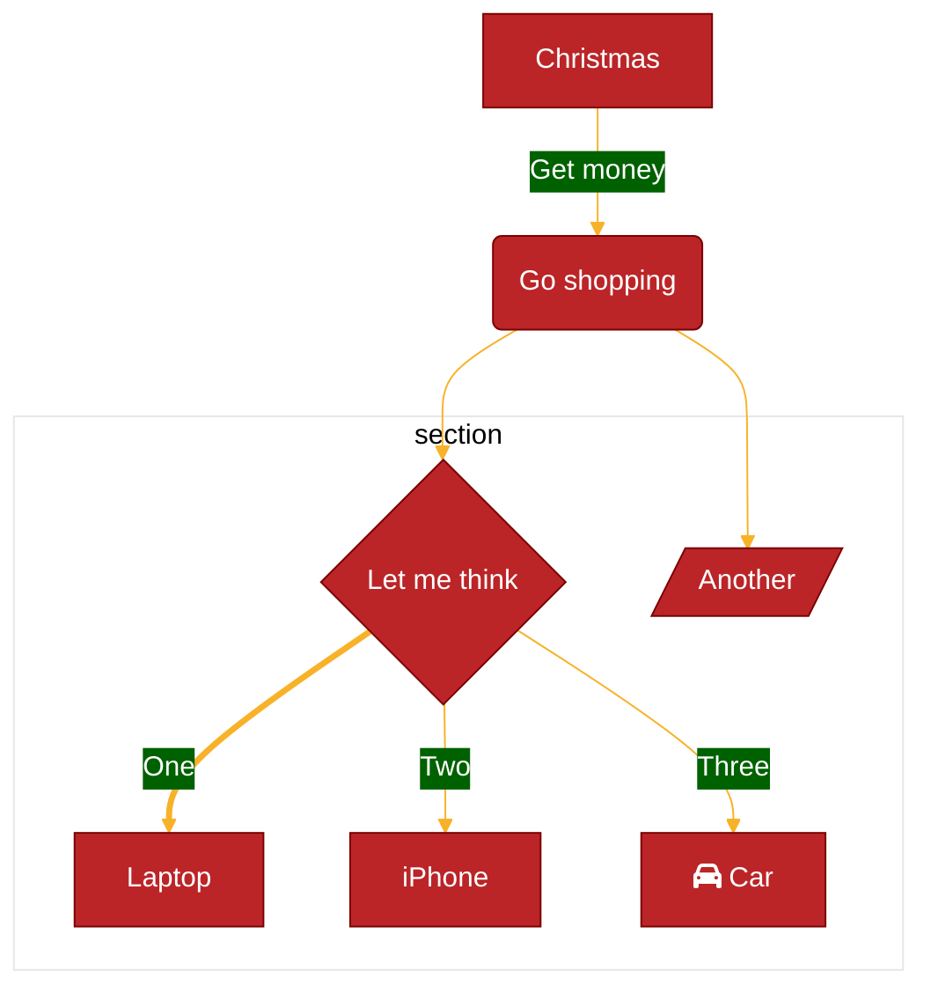

:::warning
随着 mermaid 的更新，有一些新特性是不支持的，注意测试。
:::
<blockquote1>mermaid 插件：[vuepress-plugin-mermaidjs](https://github.com/eFrane/vuepress-plugin-mermaidjs)</blockquote1><br/>
<blockquote1>mermaid 使用：[mermaid 官网](https://mermaid.js.org/intro/)</blockquote1><br/>
<blockquote1>mermaid 在线：[mermaid-live](https://mermaid.live/edit)</blockquote1><br/>

## 插件案例

### 安装插件

```sh
# 安装插件
npm install -D vuepress-plugin-mermaidjs@1.9.1
该版本插件是基于 mermaid@8.14.0 开发的
```

### 序列图案例

:::details sequenceDiagram 序列图案例
[sequenceDiagram](https://mermaid.js.org/syntax/sequenceDiagram.html)



:::

输出：


### 状态图案例

:::details State 状态图案例
[sequenceDiagram](https://mermaid.js.org/syntax/stateDiagram.html)



:::

输出：


### 饼状图案例

:::details pie 饼状图案例
[sequenceDiagram](https://mermaid.js.org/syntax/pie.html)



:::

输出：


### 主题

:::details forest 主题
mermaid 主题：[mermaid-themes](https://mermaid.js.org/config/theming.html#available-themes) `default、neutral、dark、forest、base`



:::
输出：


### 自定义主题

:::details 自定义主题，注意：theme 要使用 base
[themevariables](https://mermaid.js.org/config/theming.html#customizing-themes-with-themevariables) | [变量](https://mermaid.js.org/config/theming.html#theme-variables)



:::

输出：


